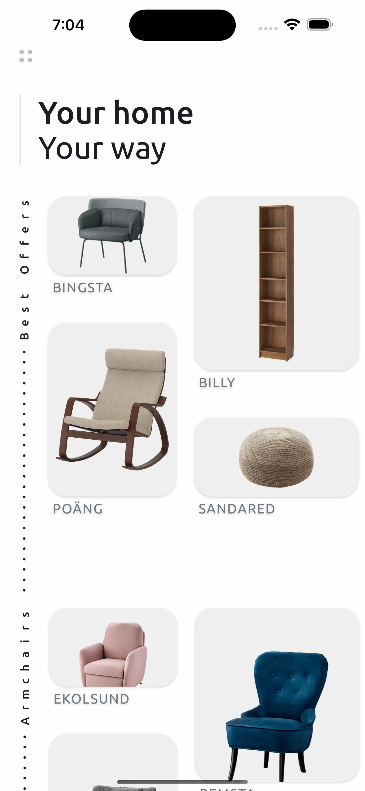
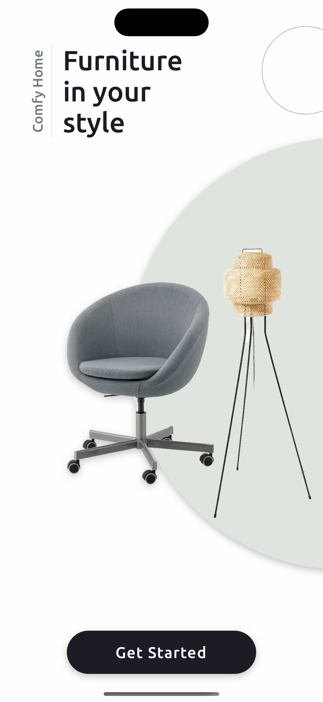
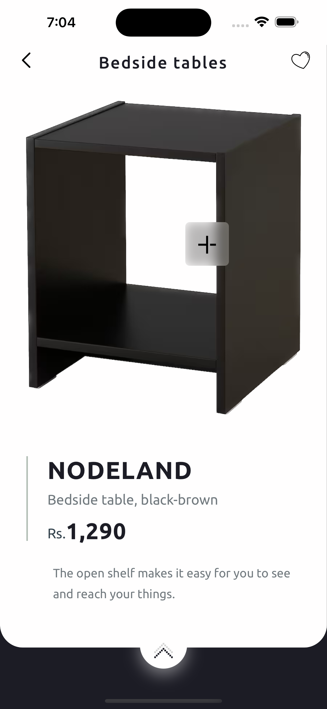
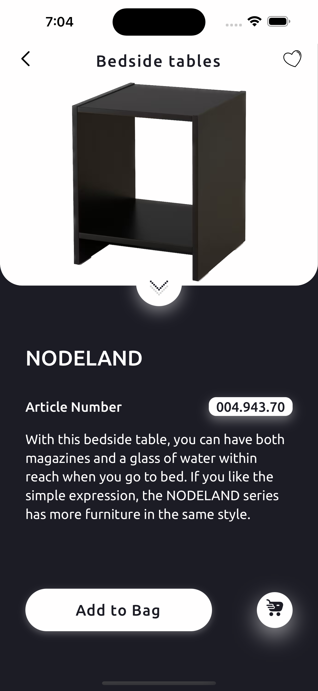
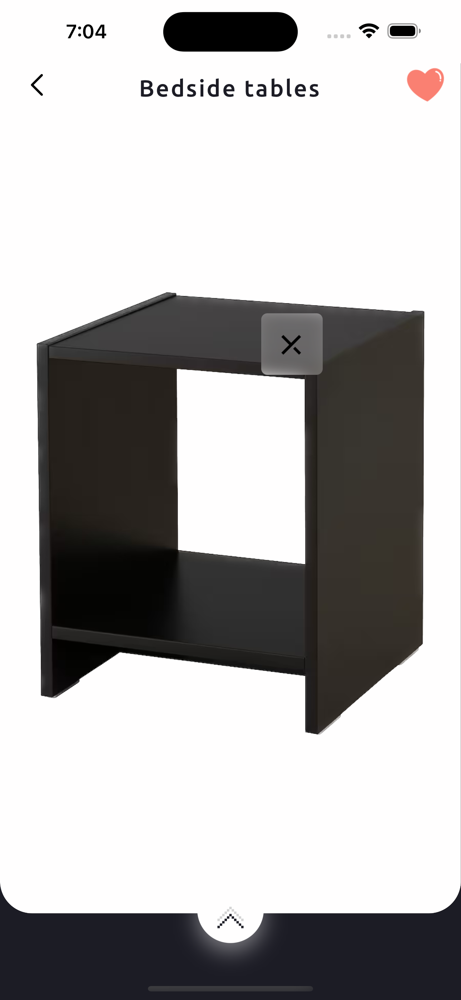

# Comfyhome - React Native
Demo video link: [{:width="200px"}](https://dl.dropboxusercontent.com/s/cq9x50qinnhbgqx/comfyhomedemo.mp4)

The Comfyhome App(Furniture) is a visually stunning mobile application developed using React Native. With its intuitive user interface, captivating animations, and seamless gestures, it provides a delightful shopping experience for users looking to explore and purchase furniture items.

## Key Features

- Stunning Visuals: The app showcases a vast collection of furniture items with high-quality images that allow users to get a detailed view of each product.

- Gesture-based Interactions: Leveraging the power of the react-native-gesture-handler library, the app offers advanced gesture recognition capabilities. Users can perform pinch gestures to zoom in and out on product images and use pan gestures for smooth swiping and movement of furniture items.

- Engaging Animations: The react-native-reanimated library is employed to create captivating animations throughout the app. Users can experience fluid navigation transitions, parallax effects, and scrolling animations with images that enhance the overall visual appeal.

- Seamless User Experience: The combination of intuitive gestures and animations creates a seamless and immersive user experience, allowing users to effortlessly explore and interact with furniture items.

- Dummy Data Integration: While the app doesn't rely on a backend, it leverages dummy data to simulate a real shopping experience. Users can view product details, like product and add product to the cart.

## Technologies Used

- React Native: A powerful and popular framework for building cross-platform mobile applications.

- React-native-gesture-handler: A library that provides gesture recognition and handling capabilities, enabling intuitive and immersive user interactions.

- React-native-reanimated: An impressive animation library that enhances the fluidity and performance of animations, delivering seamless visual experiences.

## Screenshots

## Future Enhancements

- Integration with a backend system to fetch real-time product data and enable features like user authentication, cart persistence, and order processing.

- Incorporation of additional gestures, such as swipe gestures for navigating between screens or categories.

- Integration with a payment gateway to facilitate secure and convenient online transactions.

## Installation

1. Clone the repository:

git clone https://github.com/your-username/your-repo.git

2. Install the dependencies:

cd your-repo
npm install

3. Start the development server:

npm start

4.Connect your mobile device or use an emulator/simulator to run the app.
